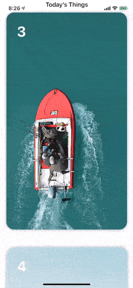

# RGStack 

This UI attempts to capture the Quibi Card Stack and the associated User Interaction. 



### Required
A View that conforms to the `ConfigurableCard` protocol

### CocoaPods

CardStack is available through [CocoaPods](http://cocoapods.org). To install it, simply add the following line to your Podfile:

```swift 
import RGStack

struct ContentView: View {
  let demos: [Demo]
  var body: some View {
      RGStack<DemoCard>(data: demos, size: .init(width: 320, height: 530))//convenience initializer
  }
}
```

### More configuration 

Use the CardInfo, which is passed to the RGStack initializer, to control more aspects of the UI Layout
```swift
struct CardInfo {
    let size: CGSize
    let gapDistance: CGFloat
    let minScaleForBackCard: CGFloat
    let visibleFractionOfBottomCard: CGFloat
}
```

A full Demo is included in the `ContentView` of the Project.

## License
[](https://opensource.org/licenses/MIT)

